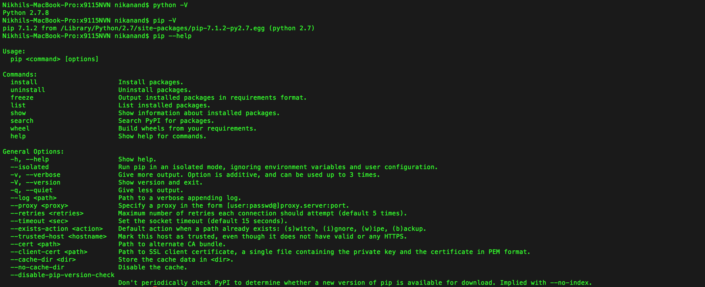

# x9115NVN
CSC 591 (Automated Software Engineering)- Repository for MASE

#Collaborators :

	>> Nikhil Satish Pai(npai)

	>> Vishal Mishra(vmishra)

	>> Nikhil Anand(nanand2)

#Homework 1:
##Snapshots

1. Repository Structure.

	

2. python, pip and easy_install installation

   

   

3. Screenshot of updated unit test in okok.py using vim  
   

4. References:  
   http://stackoverflow.com/questions/4142151/python-how-to-import-the-class-within-the-same-directory-or-sub-directory 
