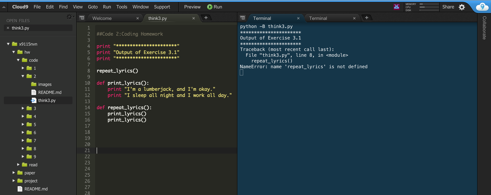
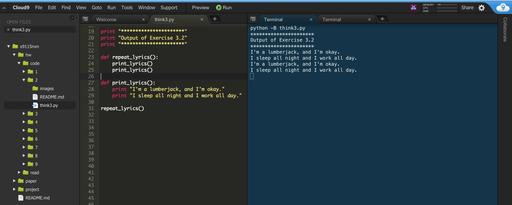
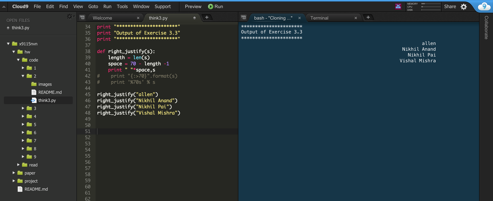
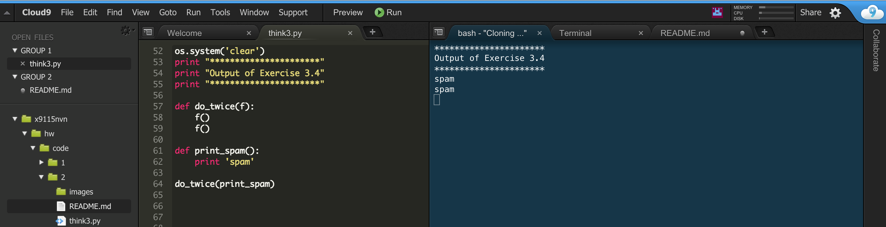
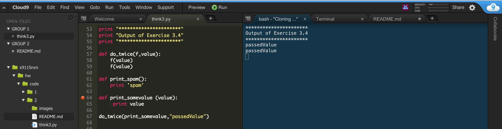
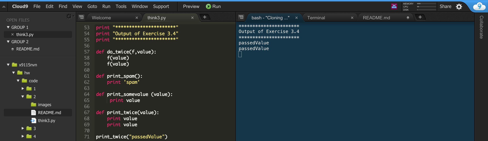
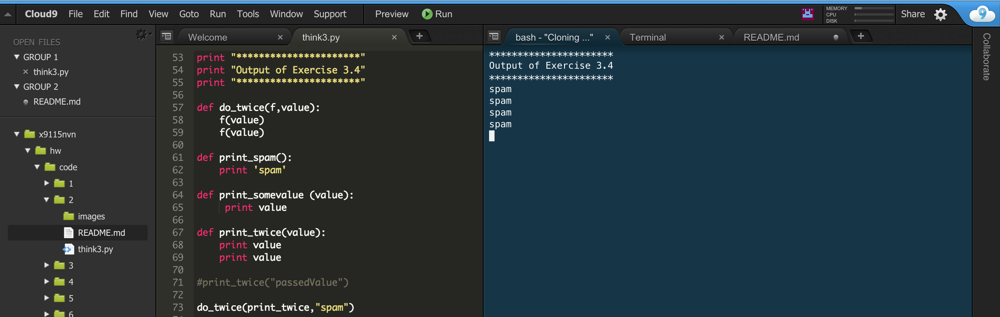
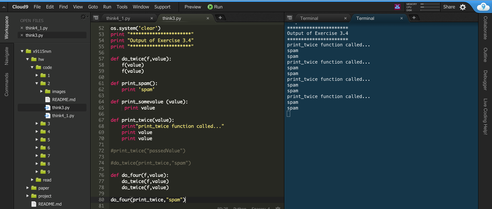
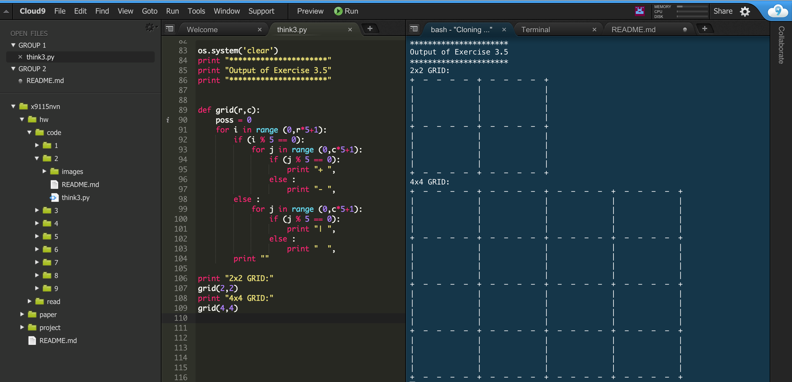

# x9115NVN
CSC 591 - MASE Repo

Collaborators :

Nikhil Satish Pai
Vishal Mishra
Nikhil Anand

# x9115NVN
CSC 591 (Automated Software Engineering)- Repository for MASE

#Collaborators :

	>> Nikhil Satish Pai(npai)

	>> Vishal Mishra(vmishra)

	>> Nikhil Anand(nanand2)

#Homework 2:
##Exercise 3.1
       
       

##Exercise 3.2
       
       
       
##Exercise 3.3
       
       
       
##Exercise 3.4

1)
       

2)
       
       
3)
       
       
4)
       
       
5)
       
       
##Exercise 3.5
       
       

Reference: 
[1] http://stackoverflow.com/questions/1402048/how-do-i-right-align-numeric-data-in-python
