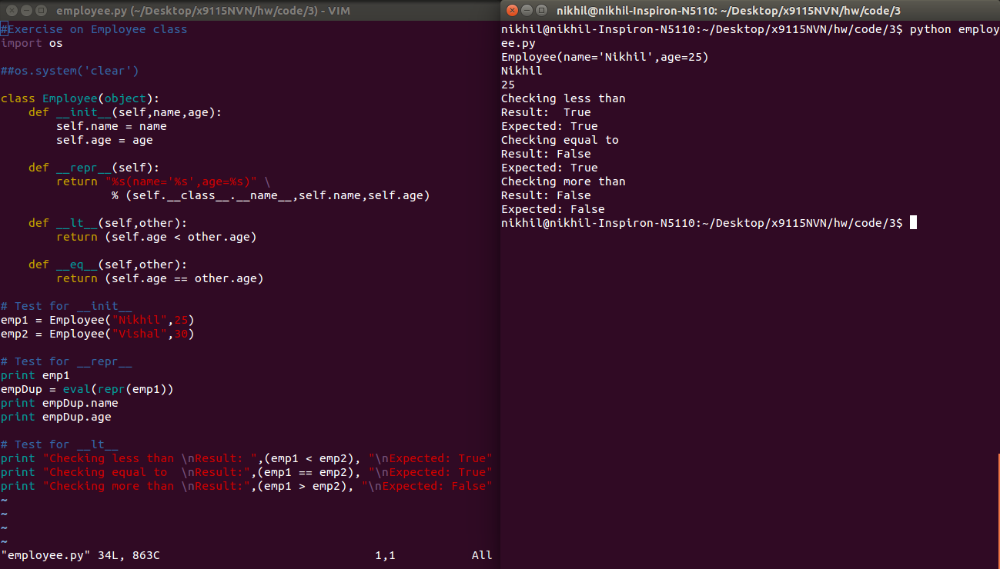

# x9115NVN
CSC 591 (Automated Software Engineering)- Repository for MASE

#Collaborators :

	>> Nikhil Satish Pai(npai)

	>> Vishal Mishra(vmishra)

	>> Nikhil Anand(nanand2)

#Homework 3:
##Screenshots

1. Birthday Paradox Output

    

2. Employee Class code and test Output.

	

3. Expected probability from Wikipedia  
   

4. 5 and 7 card hand probability  

   

5. References:  
   https://en.wikipedia.org/wiki/List_of_poker_hands#cite_note-7cardprobref-6  	
   
