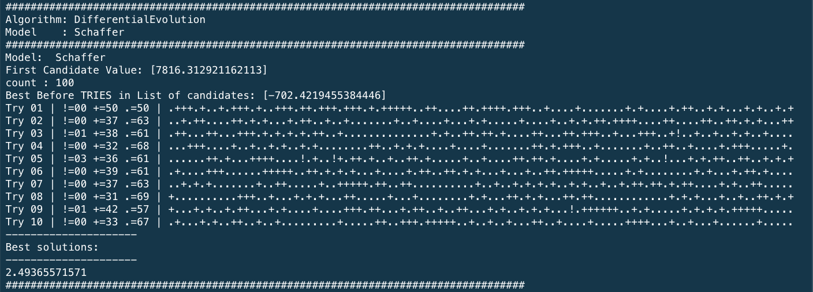
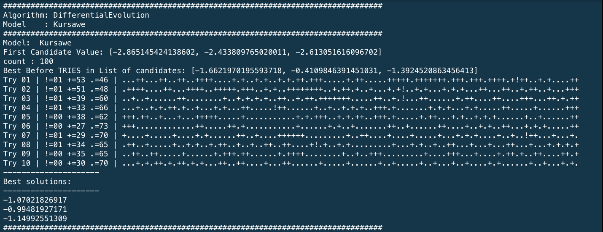
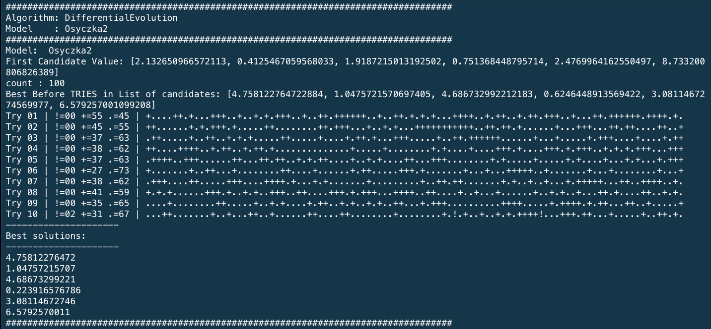
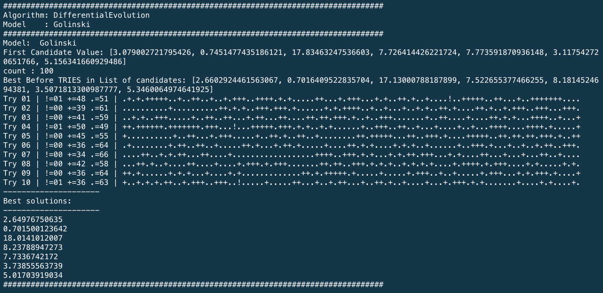

# x9115NVN
CSC 591 (Automated Software Engineering)- Repository for MASE

#Collaborators :

	>> Nikhil Satish Pai(npai)

	>> Nikhil Anand(nanand2)

#Homework 7:
##Screenshots

1. OUTPUTs:
	 
	>>ModeL: Schaffer
	
	
	
	>>ModeL: Kursawe
	
	
	
	>>ModeL: Osyczka2
	
	
	
	>>ModeL: Golinski
	
	

