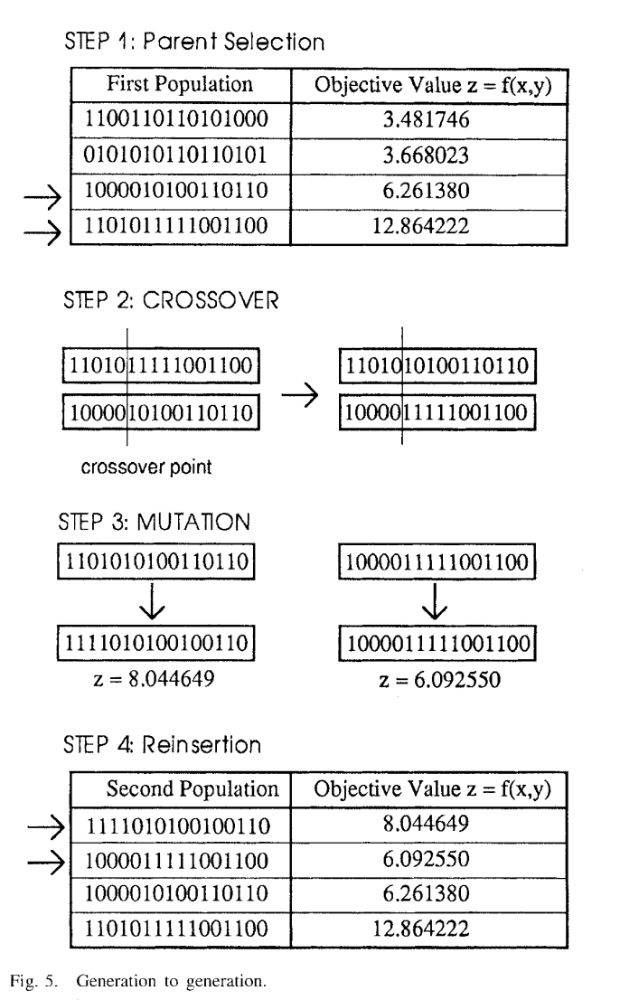
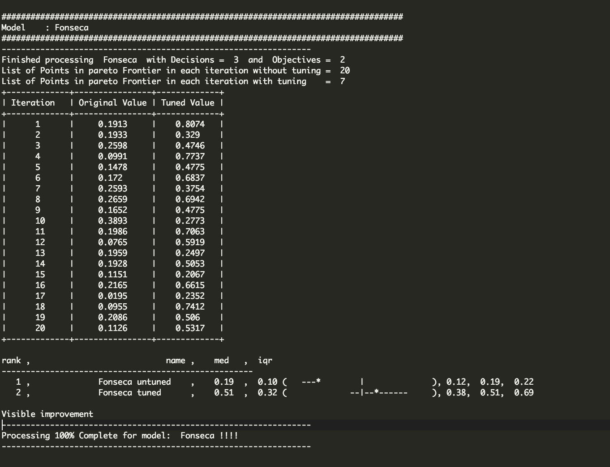
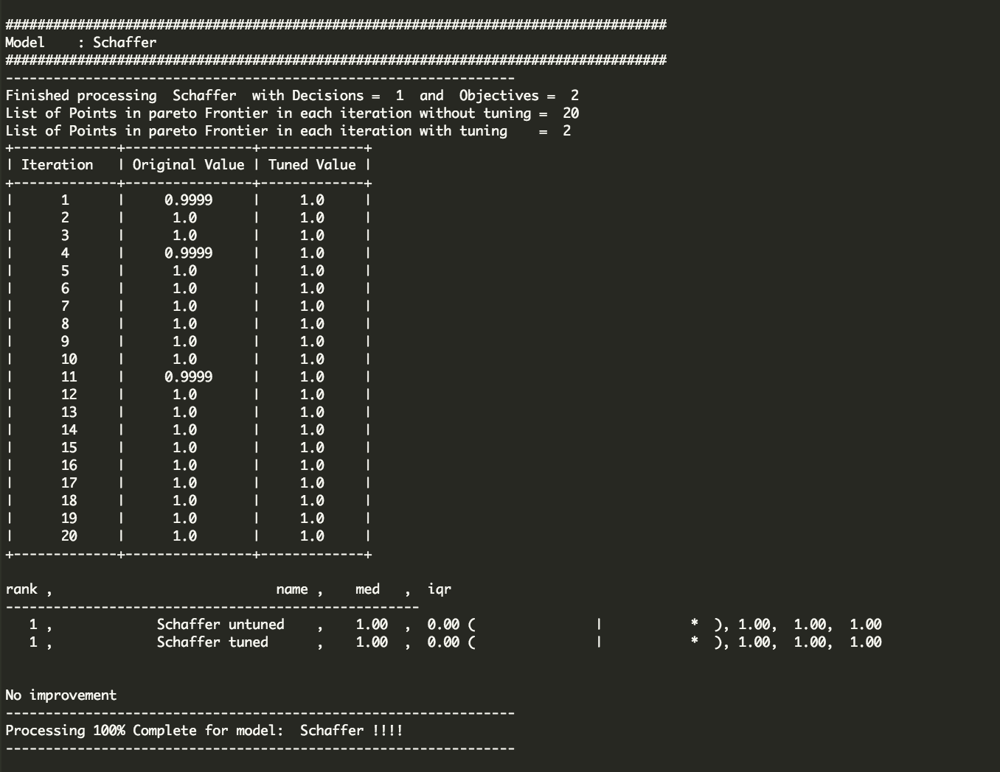
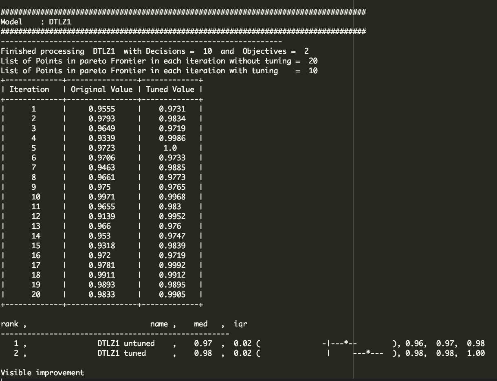
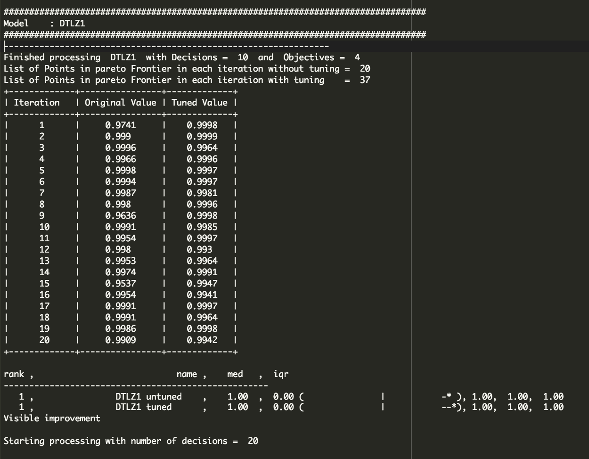
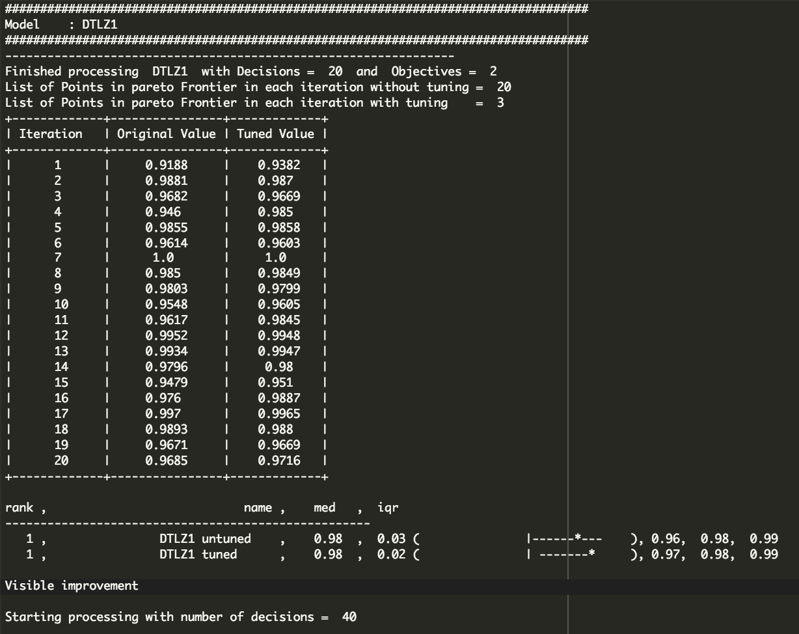
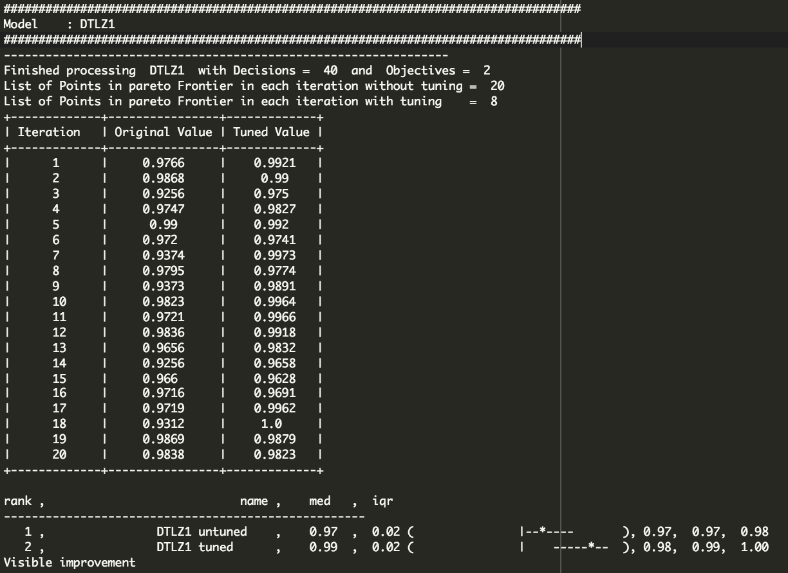

# x9115NVN
CSC 591 - MASE Repo

#Collaborators :

	>> Nikhil Satish Pai(npai)

	>> Nikhil Anand(nanand2) 

# CODE 9:   
# Title: Hyper Parameter Optimization   


### Abstract:   
We investigate effect of tuning 3 options lives, mutation rate and candidates using Differential evolution and test the the performance of the Genetic algorithm with an untuned GA on Schaffer, Fonseca and DTLZ1.

### Keywords:    
Genetic Algorithm, mutation, crossover, Differential Evolution, Tuning
  
### Main Sections:   
  A genetic algorithm is a search heuristic for solving optimization problems. They belong to a class of algorithms called evolutionary algorithms which are inspired by natural evolution techniques such as mutation, selection and crossover.
  The algorithm is as described:     
```python
    i. Randomly initialize a population     
   ii. Determine the fitness of the population      
  iii. Repeat until a terminating criteria is met        
       a. Select two parents from the population         
       b. Perform crossover on the parents creating a new child        
       c. Perform mutation of the population             
       d. Determine the fitness of the population          
```     
This is represented as show:      


#### Differential Evolution: 
   Differential Evolution is a method that optimizes a problem by iteratively trying to imporve a candidate solution with regards to a measure of quality. The algorithm can be optimized a large space of candidate solutions. DE does not use the gradient of the problem being optimized hence the problem need not be differentiable as is the case with classical optimization problems.
   DE optimizes a problem by maintaining a population of candidate solutions and creating new candidate solutions by combining existing ones according to its formula and keeping only those solutions which have the best score or fitness on the optimization problem. The optimization is treated as a black box that provides a measure of quality given a candidate solution and therefore does not need any gradient.

#### Hypervolume calculation: 
   Approximates the hypervolume of a Pareto frontier. First, it generates random samples in the hypercuboid defined by the utopia and antiutopia
 points. Second, it counts the number of samples dominated by the front. The hypervolume is approximated as the ratio 'dominated points / total 
 points'. 
 Inputs: 
 - paretoFront: the Pareto front to evaluate 
 - min: antiutopia point 
 - max: utopia point 

### Implementation :     
    The following are the major steps of our GA implementation:    
#### Step 1:      
    Run the DE algorithm on the Model to determine the tuned parameters which need to be set 
#### Step 1: 
     Run a baseline GA with default values and another GA with the tunded parameters for the given model (we choose 10,000 iterations) to calculate minimum and maximum possible values for the objectives.
     Remaining steps are applied to each run of the GA.

#### Step 2: 
     Create a list of candidates (representing the first generation of the population) for the given model (we choose 100 candidates in the population set).
#### Step 3:   
     Using binary domination on the population we determined the Pareto frontier of the initial population. This will represent the best candidates in the population.

#### Step 4:    
     We iterate to generate new populations each time, the population generated in each iteration is considered as a generation. In each new generation, any given child is generated from 2 different parents along the Pareto frontier. The two stages involved in this are Crossover and mutation.
     Crossover: We consider a single point crossover, where one part of the solution is chosen from one parent and remaining from the other as represented in the diagram.
     Mutation: The mutation is checked against a random value and if the value is lesser than the mutation rate then mutate the child.

#### Step 5:        
     For each generation we determine the Pareto frontier and perform the A12 statistical significance on the old Frontier and the new one generated. We initally start with a fixed set of lives(5). If the new Paretor frontier generated is statistically different then we increment the total number of lives by 5 else we decrement it by 1. This is used for early termination.


# Results:  
  To compare the performance the Genetic algorithm with default values and tuning using a DE optimizer.
  The results are as shown below:
        
      
 

  Scaffer does not show any significant improvement but for Fonseca there is an improvement as shown by the diagram.   
  The output for DTLZ1 is as shown, In all cases the tuned GA performs better

  
  
  
  

### Threats to Validity:   
#### Conclusion validity
We are using a DE algorithm to optimizer to select the parameters like mutation, crossover and the results show an improvement on the Fonseca model over GA with default parameters.

#### Internal validity
Since the performance of the tuned GA is better than the default GA, the treatment was introduced by the modification

#### Construct validity
Since the Tuned GA performs better than the untuned GA, the outcome correspond to the desired effect.

#### Credibility    
 The comparision operator used is binary domination, which may not be an effective measure for large multiobjective problems
 We have only tested on 5 models further testing will be needed inorder to conclusively comment on the validity of the result.

#### Dependability
  Repeated for 20 iterations hence is dependable. 

### Future Work:   
  The current runtime is large, further optimizations may be needed to reduce the same.
  We have considered only Schaffer, Fonseca and DTLZ1 this needs to be extended to include more models    

### References:          
1. [Genetic Algorithm - K.F. Man, K.S. Tang and S. Kwong, "Genetic Algorithms: Concepts and Applications", IEEE Transactions on Industrial Electronics, vol. 43, pp. 519- 534, 1996] (http://ieeexplore.ieee.org/xpl/login.jsp?tp=&arnumber=538609&url=http%3A%2F%2Fieeexplore.ieee.org%2Fxpls%2Fabs_all.jsp%3Farnumber%3D538609)
2. [Hypervolume] (http://www.mathworks.com/matlabcentral/fileexchange/50517-hypervolume-approximation)
3. [Hypervolume Paramters] (https://books.google.com/books?id=6K3zflc_bNkC&pg=PA138&lpg=PA138&dq=how+many+choose+sample+size+for+hypervolume+calculation&source=bl&ots=ZlqfiANho3&sig=CHWzgRpvzqj3A7H1J21OnP8FHpw&hl=en&sa=X&ved=0ahUKEwiXwOPyp8HJAhUK6SYKHe93C-MQ6AEIMjAD#v=onepage&q=how%20many%20choose%20sample%20size%20for%20hypervolume%20calculation&f=false)
