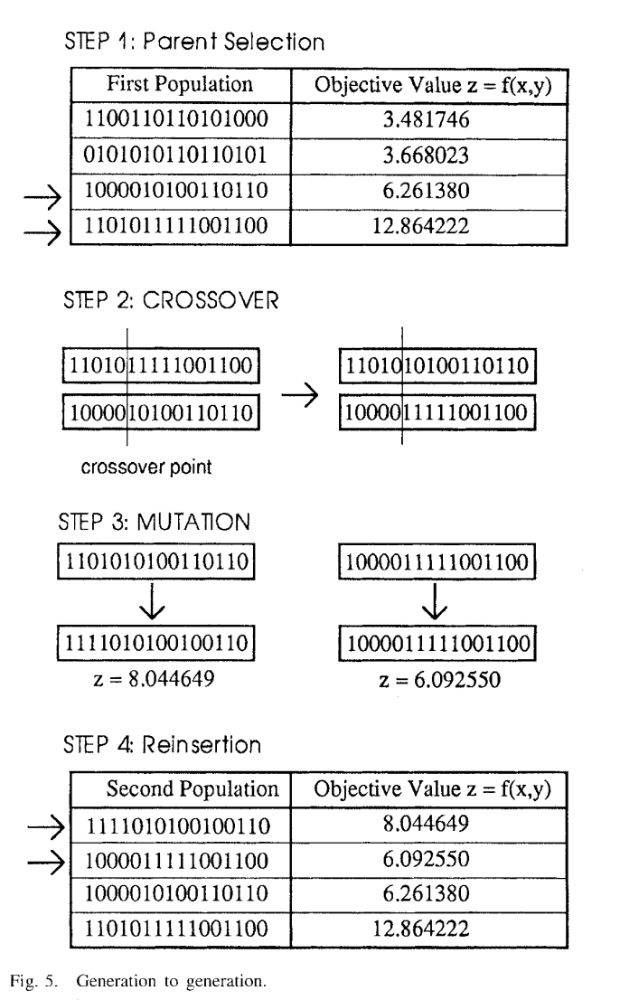
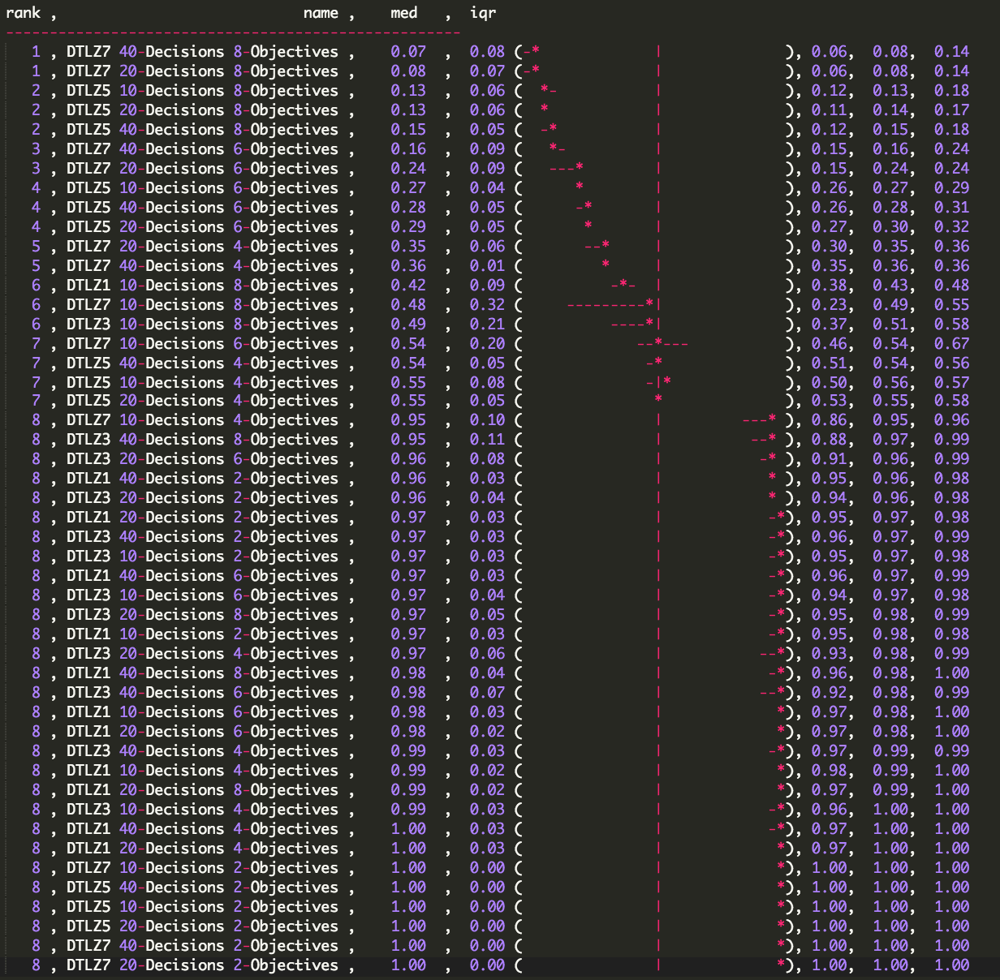

# x9115NVN
CSC 591 - MASE Repo

#Collaborators :

	>> Nikhil Satish Pai(npai)

	>> Nikhil Anand(nanand2) 

# CODE 9:   
# Title: Simplified Standard Genetic Algorithm

### Abstract:   
We investigate the performance of a standard genetic algorithm on DTLZ1,3,5,7 and compare their performance with varying objectives and decisions. 

### Keywords:    
Genetic Algorithm, mutation, crossover

### Main Sections:   
  A genetic algorithm is a search heuristic for solving optimization problems. They belong to a class of algorithms called evolutionary algorithms which are inspired by natural evolution techniques such as mutation, selection and crossover.
  The algorithm is as described:     
```python
    i. Randomly initialize a population     
   ii. Determine the fitness of the population      
  iii. Repeat until a terminating criteria is met        
       a. Select two parents from the population         
       b. Perform crossover on the parents creating a new child        
       c. Perform mutation of the population             
       d. Determine the fitness of the population          
```     
This is represented as show:      



### Implementation :     
    The following are the major steps of our GA implementation:    
#### Step 1: 
     Run a baseline for the given model (we choose 10,000 iterations) to calculate minimum and maximum possible values for the objectives.
#### Step 2: 
     Create a list of candidates (representing the first generation of the population) for the given model (we choose 100 candidates in the population set).
#### Step 3:   
     Using binary domination on the population we determined the Pareto frontier of the initial population. This will represent the best candidates in the population.

#### Step 4:    
     We iterate to generate new populations each time, the population generated in each iteration is considered as a generation. In each new generation, any given child is generated from 2 different parents along the Pareto frontier. The two stages involved in this are Crossover and mutation.
     Crossover: We consider a single point crossover, where one part of the solution is chosen from one parent and remaining from the other as represented in the diagram.
     Mutation: The mutation is checked against a random value and if the value is lesser than the mutation rate then mutate the child.

#### Step 5:        
     For each generation we determine the Pareto frontier and perform the A12 statistical significance on the old Frontier and the new one generated. We initally start with a fixed set of lives(5). If the new Paretor frontier generated is statistically different then we increment the total number of lives by 5 else we decrement it by 1. This is used for early termination.

#### Genetic Algorithm Parameters:
```python   
    Number of Candidates       : 100     
    Number of Generations      : 1000
    Mutation Rate              : 0.05     
    Initial Lives              : 5
    Initial Baseline Run Count : 10000 
    One point crossover
```
#### Hypervolume calculation: 
   Approximates the hypervolume of a Pareto frontier. First, it generates random samples in the hypercuboid defined by the utopia and antiutopia
 points. Second, it counts the number of samples dominated by the front. The hypervolume is approximated as the ratio 'dominated points / total 
 points'. 
 Inputs: 
 - paretoFront: the Pareto front to evaluate 
 - min: antiutopia point 
 - max: utopia point 
 - number of sample for the approximation
 Outputs: 
 - hv : hypervolume = count/(sample)        

   SAMPLE SIZE:
   10000 samples are required to get error rate less than 5%
  
### Running Instructions:    
  Execute the ["RunCode9.py"] (https://github.com/maverickmishra/x9115NVN/blob/master/hw/code/CODE9/RunCode9.py) in to view the output.     


### Results:  
  We have executed the algorithm on DTLZ1,3,5,7 with decisions 10,20,40 and objectives 2,4,6,8 
  To compare the performance of each of the optimizers we have used the hypervolume as the measure. The each model was run 20 times, calculating the hypervolume for each run.

 


  For individual models(DTLZ1,3,5,7) Objectives(2,4,6,8) and Decisions(10,20,40) combination, results can be seen under [data](https://github.com/maverickmishra/x9115NVN/tree/master/hw/code/CODE9/data)


### Threats to Validity:   
#### Conclusion validity
  We are verifying that there is a significant statistical difference inorder to perform early termination of the algorithm.

#### Internal validity
  For the mutation step if the required conditions are met then all decision of the child are changed ignoring the crossover.

#### Dependability
 The measurements were done by running the algorithm for 20 runs for each Model-objective-decision.

#### Credibility    
 The comparision operator used is binary domination, which may not be an effective measure for large multiobjective problems

### Future Work:   
  The current runtime is large, further optimizations may be needed to reduce the same.
  Tuning the parameters of the GA to test the performance 
  Currently we have implemented binary domination to compare points along the perato frontier but this does not scale well with increase in objectives and also it provides only a qualitative measure for the domination. The algorithm can be tested with continuous domination
  The performance of the Genetic Algorithm can be tested against NSGA II, GALE


### References:          
1. [Genetic Algorithm - K.F. Man, K.S. Tang and S. Kwong, "Genetic Algorithms: Concepts and Applications", IEEE Transactions on Industrial Electronics, vol. 43, pp. 519- 534, 1996] (http://ieeexplore.ieee.org/xpl/login.jsp?tp=&arnumber=538609&url=http%3A%2F%2Fieeexplore.ieee.org%2Fxpls%2Fabs_all.jsp%3Farnumber%3D538609)
2. [Hypervolume] (http://www.mathworks.com/matlabcentral/fileexchange/50517-hypervolume-approximation)
3. [Hypervolume Paramters] (https://books.google.com/books?id=6K3zflc_bNkC&pg=PA138&lpg=PA138&dq=how+many+choose+sample+size+for+hypervolume+calculation&source=bl&ots=ZlqfiANho3&sig=CHWzgRpvzqj3A7H1J21OnP8FHpw&hl=en&sa=X&ved=0ahUKEwiXwOPyp8HJAhUK6SYKHe93C-MQ6AEIMjAD#v=onepage&q=how%20many%20choose%20sample%20size%20for%20hypervolume%20calculation&f=false)
