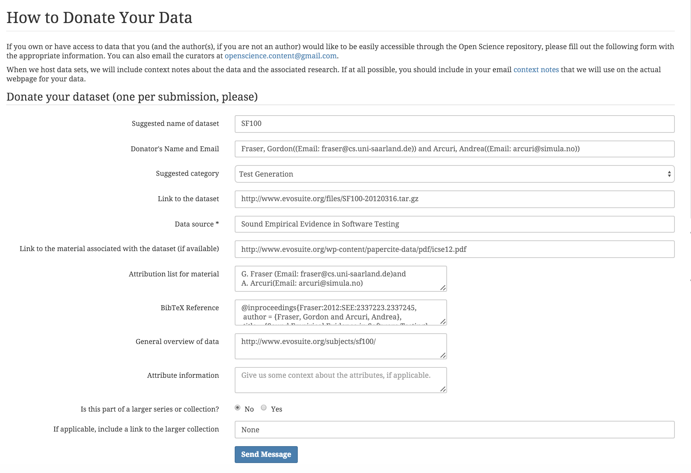

# x9115NVN
CSC 591 (Automated Software Engineering)- Repository for MASE

#Collaborators :

	>> Nikhil Satish Pai(npai)

	>> Nikhil Anand(nanand2)

#Read 6:: Reusable Data:

BibTeX Reference:
@inproceedings{Fraser:2012:SEE:2337223.2337245,
 author = {Fraser, Gordon and Arcuri, Andrea},
 title = {Sound Empirical Evidence in Software Testing},
 booktitle = {Proceedings of the 34th International Conference on Software Engineering},
 series = {ICSE '12},
 year = {2012},
 isbn = {978-1-4673-1067-3},
 location = {Zurich, Switzerland},
 pages = {178--188},
 numpages = {11},
 url = {http://dl.acm.org/citation.cfm?id=2337223.2337245},
 acmid = {2337245},
 publisher = {IEEE Press},
 address = {Piscataway, NJ, USA},
} 

##Screenshots

1. OUTPUTs:
	 
	
	

Reference: http://www.evosuite.org/subjects/sf100/
